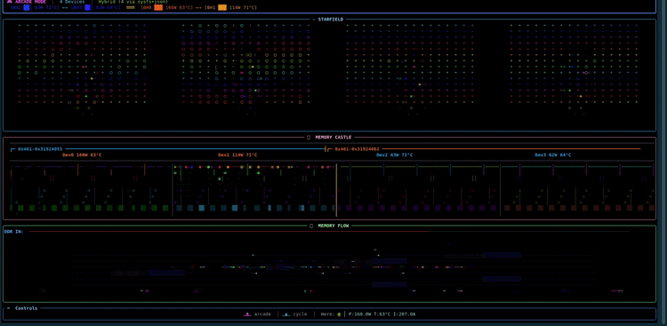
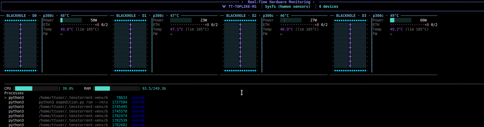
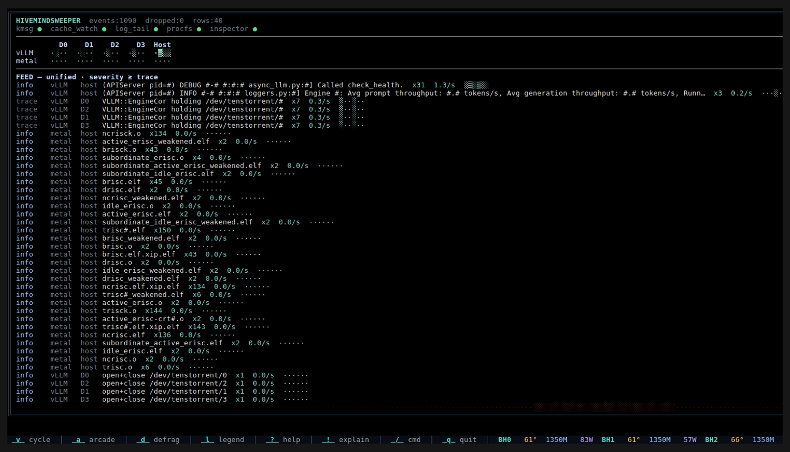
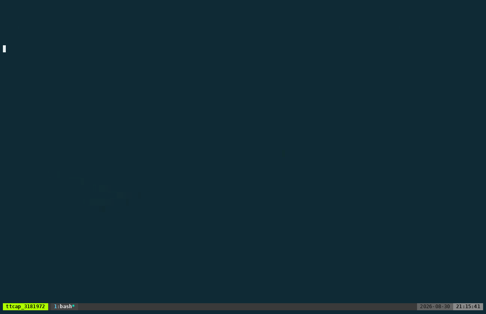

# tt-toplike 🦀

Real-time hardware monitoring for Tenstorrent silicon (Grayskull, Wormhole, Blackhole). Written in Rust.



**[📖 Docs](https://docs.tenstorrent.com/tt-toplike) · [📦 Releases](https://github.com/tenstorrent/tt-toplike/releases) · [🌐 Project site](https://tenstorrent.github.io/tt-toplike/)**



*Insights screen — split-panel view of all 4 Blackhole chips captured during live inference. Each panel shows chip portrait, live power (58–77W), temperature, DDR training status, and accuracy trend.*

The Insights screen works on any machine — it shows each processor (CPU/GPU/ANE/TT) as a device card and lists processes by resource use, tagging those that match known inference runtimes (ollama, vLLM, llama.cpp, MLX, ComfyUI, …); on TT hardware it additionally attributes device usage and serving metrics per process.

## How visualizations are grounded in hardware activity

The visualizations aren't decorative. Every particle, star, color shift, and brightness change maps to a real signal coming off the hardware. Here's what you're actually looking at.

### The signals

tt-toplike reads a small set of telemetry values from the chip — through the two sysfs surfaces the Tenstorrent kernel driver exposes (the standard Linux hwmon sensors, plus tt-kmd's own `/sys/class/tenstorrent/` attribute directory), through `tt-smi`, or directly through Luwen — and drives everything from those:

- **Power (W)** — total chip power draw, measured continuously. On boards that report it, whole-card *board* power is read alongside the per-ASIC figure
- **Temperature (°C)** — die temperature from the ASIC thermal sensor
- **Current (A)** — current draw; a fast-moving proxy for compute intensity
- **Clock frequencies** — AICLK, AXICLK and ARCCLK, straight from the driver
- **Firmware limits** — the board's real TDP / TDC / thermal ceilings (a p300c reports 125 W, 500 A, 90 °C), so "how hot is hot" is calibrated to *your* card instead of a generic reference number
- **DDR training status** — per-channel bitmask from SMBUS: whether each DDR channel is idle, training, trained, or faulted
- **GDDR ECC counters** — correctable and uncorrectable memory errors; the uncorrectable count is the one that means data corruption, so it's called out in red when it moves
- **Thermal-trip count** — how many times the card has hit hardware thermal shutdown in its lifetime. Non-zero is a story
- **PCIe link traffic** — the driver keeps data-word counters for both directions of the PCIe link; differentiating them between ~1 Hz samples gives live bytes/sec into and out of the chip, next to the link's generation and width
- **ARC heartbeat** — the RISC-V management firmware pulses this counter to signal it's alive. A frozen heartbeat is how the tool tells "busy" from "wedged"

Most of that arrives without shelling out to anything. The safe default backend reads the driver's sysfs attributes directly, so clocks, the ARC heartbeat, the board SKU, firmware version and PCIe counters all come for free — `tt-smi` is only needed for the deeper SMBUS block (DDR training detail, per-component firmware versions, GDDR sensors). Older drivers simply expose fewer attributes, and the corresponding readouts drop out rather than breaking anything; see [`docs/SYSFS_BACKEND.md`](docs/SYSFS_BACKEND.md) for exactly which fields come from where.

There's also an **adaptive baseline**: for the first ~20 samples the tool learns your chip's idle state. After that, everything is shown as *relative change* from baseline rather than absolute values. A chip drawing 20W shows the same visual intensity as a chip drawing 80W at the same fraction above its idle state. This makes the tool work equally well across hardware generations.

### How colors are chosen

Every color is computed from a single function: `hsv_to_rgb(hue, saturation, value)`.

**Hue** (which part of the spectrum) is a combination of:
- A *temperature anchor* — `temp_to_hue()` maps 0–100 °C to 180°–0° (cyan at cold, red at hot). This is the baseline.
- A *time drift* — the frame counter slowly rotates the hue through the full 360° wheel over ~7 seconds. This is what produces the rainbow sweep during LLM inference: each inference burst arrives in a different part of the spectrum.
- A *position offset* — in the starfield, each Tensix core has its own phase, so the grid shows a color wave rather than all cores flipping simultaneously. In Memory Castle, the four particle types are spaced 90° apart (a tetrad), so Read/Write/CacheHit/CacheMiss are always visually distinct regardless of where the sweep currently is.
- A *channel spread* — in Memory Flow, each DDR channel adds 30° of offset, so 12 channels fan out across the entire color wheel.

**Saturation** (vividness) is pinned at or near 1.0 everywhere except dim background elements. There's no muting.

**Value** (brightness) is driven by activity: low power → dim characters and low value; high power → bright characters and high value. In the starfield, the character itself also encodes brightness (`·∘○◉●`), so you get two independent brightness cues — color value and character weight — which together create good depth contrast at different activity levels.

The result is that idle hardware shows a slowly-rotating pastel palette, and active hardware shows saturated, vivid colors cycling rapidly through the spectrum.

### What an LLM thinking looks like

Autoregressive inference (token-by-token generation) has a characteristic rhythm. Each token is a sequential forward pass — attention over a growing KV cache, then a matrix multiply through the FFN. Between tokens there's almost nothing happening. This creates a **pulsed pattern**: brief compute bursts spaced by the model's generation cadence, typically a few hundred milliseconds each. The power trace looks like a comb.

In Memory Castle, this shows up as waves of particles that swell and thin. In the starfield, stars pulse brighter during each token's compute burst then settle back. The particle hue sweeps through the rainbow over about 7 seconds — so during a long thinking pause you'll see one color family, and the burst of the next token arrives in a different hue band.

Temperature lags power by several seconds (thermal mass of the package), so the color signal always trails the activity signal. You can see the chip "remembering" the heat from three tokens ago.

### What WAN 2.2 generation looks like

Video diffusion is a different animal. Each denoising step is a full forward pass of a large model — not a quick autoregressive decode but a sustained, high-memory-bandwidth computation that runs for hundreds of milliseconds. Steps happen sequentially through the diffusion schedule.

The result is **sustained high power with structured plateaus**: you'll see the visualization stay dense and bright for the full duration of a step, then briefly relax between steps as the scheduler loads the next noise level. The Memory Castle particles stop thinning out between bursts — the dungeon stays full. In Arcade mode, the `@` hero sits high and right (high power, high current) and barely moves, which is its own kind of signal. In the Defrag panel (standalone or embedded in Arcade), the block fill stays dense and near-full for the whole diffusion step — the palette shifts steadily warmer as GDDR temperature climbs over minutes of sustained compute, and scatter bursts fire on each step's power ramp-up, making the denoising schedule visible as a sequence of flashes.

Temperature climbs higher and holds there. The color of everything — stars, particles, backgrounds — shifts warmer because `temp_to_hue()` biases toward red as the die heats up.

### Why idle still has a lot of activity

A "quiet" Blackhole is never actually quiet. Several things generate continuous background power:

- **ARC firmware** — the four RISC-V management cores run continuously handling thermals, SMBUS communication, PCIe link monitoring, and power regulation. This costs a few watts of baseline power.
- **DDR refresh** — LPDDR keeps all its trained channels alive with periodic refresh cycles. The DDR channels show as trained (solid bars) even with no user workload.
- **SRAM retention** — L1 and L2 SRAM need continuous power to hold state. The tensix grid never fully powers down.
- **PLL lock** — the clock network (AICLK, AXICLK, ARCCLK) runs continuously.

The adaptive baseline captures all of this and treats it as zero-point. What you see in the visualization at idle is the true floor: particles spawning slowly and evenly, stars dim but present, the `@` hero drifting in the lower-left of the Arcade canvas, and the Defrag block map sitting full but cool — no scatter bursts, palette at its coolest hue (no thermal shift), brightness at segment floor. That floor has meaning — it's the hardware telling you it's alive and maintained.

### Running `tt-smi -r` while watching

`tt-smi -r` triggers a hard reset of the TT device: PCIe link goes down, the ARC firmware restarts from scratch, and all DDR channels retrain from zero. If you have tt-toplike running and do this in another terminal, you get a genuine light show backed by real hardware events:

1. **Power drop** — as the chip resets, power briefly collapses toward zero. Particles stop spawning. The starfield dims out. The dungeon goes quiet.
2. **Defrag EVICT** — if you were in Defrag or Arcade mode with a model loaded, the power drop triggers the `EVICT` animation: each GDDR channel's blocks dissolve right-to-left (red→orange fade) at staggered speeds, with each chip's channels evicting at different rates via prime-number drain multipliers. Once all blocks drain to zero, the DMA rebuild animation starts automatically from scratch — blocks fill left-to-right again as the DDR channels retrain.
3. **DDR retraining** — the SMBUS DDR status bitmask flips channel-by-channel from *trained* → *idle* → *training* → *trained* as each channel comes back online. In Memory Flow's channel bars, you watch the channels relight one at a time. This takes a few seconds and the order is deterministic per chip.
4. **ARC restart** — the heartbeat goes dark and comes back. ARC health indicators flicker red then green as the firmware finishes booting.
5. **Power renormalization** — once the chip is back, the adaptive baseline has to re-learn idle state over the next 20 samples. During this window the visualization is slightly over-reactive — everything looks more active than it is while the baseline recalibrates. This produces the most visually intense few seconds of the whole sequence.

The full reset-to-stable cycle typically takes 10–15 seconds. tt-toplike's safe backends (sysfs, JSON) survive the reset without crashing because they're just reading kernel files — they just see a brief gap in data.

---

## Try it on any machine — no TT hardware required (experimental)

```bash
tt-toplike --host          # or: tt-toplike --backend host
tt-toplike --host --mode arcade
tt-toplike --host --mode flow
```

> **Experimental.** `--host` and the macOS/Windows builds are a preview. Use them to get a feel for every visualization on the machine you already have — your laptop, workstation, or a CPU box — *before* you get your Tenstorrent cloud instance, cards, or towers. When the real silicon arrives, drop `--host` and everything you learned transfers directly.

`--host` reads your CPU frequency, temperature, and RAM usage and maps them into the same telemetry fields as a TT accelerator. Every visualization works: Starfield, Memory Castle, Memory Flow, Arcade. Your CPU cores glow as stars. RAM fill drives the DDR-channel bars. Package temperature shifts the color palette.

> **The observer effect is real here.** On a TT accelerator the visualizer runs on the host CPU and watches a *separate* chip, so it barely perturbs what it measures. In `--host` mode the visualizer and the thing it's visualizing are the same CPU — rendering Arcade at a high frame rate burns cycles that then show up *in the visualization itself* as higher utilization, frequency, and temperature. You're partly watching tt-toplike watch itself. That feedback loop is a quirk of host mode, not a bug; switch modes or lower the FPS (`/fps 10`) to damp it. It also makes a quiet point: nothing you do to a real TT card from the host steals compute from the workload the way it does here.

**Runs on Linux and macOS; Windows is built in CI with a headless runtime smoke** (`--bench` on `windows-latest`), though the interactive TUI hasn't been hand-tested on Windows yet — treat it as best-effort. Linux-only pieces — procfs, the `/proc` socket table, the `libc` kill panel — are `cfg`-gated out on Windows. `--host` is the one non-mock backend that needs no Tenstorrent hardware and no Linux kernel interfaces, so it's the way to explore tt-toplike on a laptop. What's available depends on the OS:

| Metric | Linux | macOS / Windows |
|--------|-------|-----------------|
| CPU frequency (→ AICLK) | ✅ | ✅ |
| CPU utilization (→ current proxy) | ✅ | ✅ |
| RAM usage (→ DDR channels) | ✅ | ✅ |
| Package temperature | ✅ via hwmon | ⚠️ not exposed — reads 0 |
| Package power | ✅ via RAPL (`/sys/class/powercap`) | ⚠️ not exposed — estimated/0 |

CPU package temperature and RAPL power come from Linux-only sysfs paths; on macOS/Windows those fields are simply absent (the temperature-driven color palette stays at its baseline). Everything else is driven by the cross-platform `sysinfo` crate.

It is not the same experience as real TT hardware — a discrete AI accelerator has DDR bandwidth, Tensix grid geometry, and ARC firmware that a CPU can't replicate. But it gives you the full visual engine to explore. Once you have TT hardware, remove `--host` and everything you learned transfers directly.

**Every hardware type shows you something you can't see anywhere else.** A CPU under `--host` has its own rhythm; a Wormhole's 8 DDR channels train differently than a Blackhole's 12; Grayskull's grid geometry is its own shape entirely; and a multi-card tower or cloud fleet lights up the fleet-grid and topology views that a single chip never will. The point of host mode isn't to substitute for any of that — it's to learn the visual language now, so the uniqueness of each real device is legible the moment you plug it in.

On Apple Silicon, `--host` also surfaces the **GPU** (utilization + memory, via
`ioreg`) and the **Neural Engine** (power, via the private IOReport framework) as
extra devices — both **without sudo**. Caveats: ANE shows power-derived activity,
not a true utilization % (no API exposes one); its "16 cores" is Apple's stated
figure used only for the star grid; GPU power/temperature/frequency aren't
available without sudo; and GPU utilization is whole-device, not per-process.

---

## Watch a box remotely over the LAN (`--remote`, experimental)

If a Tenstorrent box on your network runs the **tt-station** agent, you can watch
it from another machine — your Mac, a laptop — with no local TT hardware:

```
tt-toplike --remote qb2-lab.local:8765      # or any HOST:PORT (bare host → :8000)
tt-toplike --remote 192.168.1.42:8765 --mode starfield
```

The box's `tt-station-agentd` publishes a WebSocket at `ws://<host>:<port>/telemetry`
that streams the verbatim `tt-smi -s` snapshot on an interval; tt-toplike's
`--remote` backend consumes those frames **exactly like local telemetry** — same
`Telemetry`/`SmbusTelemetry` structs, same render path, every visualization
unchanged. It's the "QuietBox on your desk, on your Mac's screen" view.

If the publisher enriches its stream with the optional `tt_toplike` extension
(both a tt-toplike `--serve` and a suitably-updated `tt-station-agentd` do — see
below), the process panel and the `[i]` inference monitor also describe the
**remote box**: you see its processes and its serving workload, not your laptop's.
When the stream carries only chip telemetry, those two panels fall back to the
**local** machine's data and say so with a `LOCAL` label — so you're never misled
about whose processes you're looking at.

This is **strictly additive**: `--remote` is a new backend alongside the local
ones, opt-in only (never entered by auto-detect or Tab-cycling); everything else
is untouched. Telemetry is unauthed today — trusted-LAN only. See
`docs/REMOTE_QUIETBOX_DESIGN.md`.

---

## Be the box: publish your own telemetry (`--serve`, experimental)

The flip side of `--remote`: any tt-toplike can *serve* a `/telemetry` stream that
another tt-toplike (or anything speaking the same WebSocket) connects to. The
remote data source is no longer a single `tt-station` agent — every box running
tt-toplike can broadcast itself.

```
tt-toplike --serve                       # bind 0.0.0.0:8770 AND run the TUI (serve while you watch)
tt-toplike --serve 0.0.0.0:9000          # custom BIND:PORT
tt-toplike --serve --backend json | cat  # no TTY → headless collector loop, no UI
```

At a real terminal, `--serve` runs the normal TUI *and* publishes in the same
process — the status bar shows `◉ serving :PORT · N clients`. Piped/headless (no
TTY), it becomes a quiet collector loop with no UI. You can also start/stop it
live from inside the app with `/serve [BIND:PORT]` and `/serve off`, mirroring
`/remote`.

The published frame is valid `tt-smi -s` JSON plus one optional additive
top-level key, `tt_toplike` (`{schema, processes[], inference[]}`), carrying this
box's process list and `[i]` inference state. Older consumers that only read
telemetry ignore the extra key; a tt-toplike `--remote` renders the full box from
it. `--serve` requires the `json` or `hybrid` backend (the only ones that retain a
raw tt-smi frame to relay). Combined with `--remote`, tt-toplike acts as a relay:
it re-broadcasts the watched box's frame verbatim, so downstream viewers see the
origin box, not the relay host.

Default bind `0.0.0.0:8770`; plaintext and unauthed, same trusted-LAN posture as
`--remote`. Everything is behind the default-on `remote` cargo feature. See
`docs/superpowers/specs/2026-07-05-serve-broadcast-design.md` for the frame
contract and the `tt-station-agentd` coordination notes.

---

## Installation

### Debian / Ubuntu — apt (Tenstorrent PPA, recommended)

`tt-toplike` is published in the **Tenstorrent apt repository** at `ppa.tenstorrent.com` — the easiest way to get the latest version and keep it current with `apt upgrade`. Add the repository once, then install:

```bash
# Add Tenstorrent's package-signing key and apt repository
sudo install -m 0755 -d /etc/apt/keyrings
sudo wget -qO /etc/apt/keyrings/tt-pkg-key.asc https://ppa.tenstorrent.com/tt-pkg-key.asc
echo "deb [signed-by=/etc/apt/keyrings/tt-pkg-key.asc] https://ppa.tenstorrent.com/ubuntu/ $(. /etc/os-release && echo "$VERSION_CODENAME") main" \
  | sudo tee /etc/apt/sources.list.d/tenstorrent.list
sudo apt update

# Install
sudo apt install tt-toplike        # TUI monitor
sudo apt install tt-toplike-app    # optional native window host (needs a display)

# Verify
tt-toplike --mock --mock-devices 4
```

Installing from the repo also surfaces the tools tt-toplike works with (`tt-smi`, `tenstorrent-dkms`) as `Recommends`, so apt pulls them in by default. The same repository hosts the whole Tenstorrent stack; the all-in-one [`tt-installer`](https://github.com/tenstorrent/tt-installer) sets it up along with the kernel driver and firmware if you want everything at once.

### Debian / Ubuntu — download a specific .deb

Prefer a pinned version, or on an air-gapped box? Each release also ships standalone `.deb` packages. Pick the one that matches your Ubuntu version:

| Package suffix | Ubuntu version | glibc requirement |
|---------------|----------------|-------------------|
| `_noble.deb`  | 24.04 (Noble) and newer | libc6 ≥ 2.39 |
| `_jammy.deb`  | 22.04 (Jammy) and newer | libc6 ≥ 2.35 |

```bash
# Detect your Ubuntu version and download the matching packages
SUITE=$(. /etc/os-release && echo "$UBUNTU_CODENAME")
[ "$SUITE" = "noble" ] || SUITE="jammy"   # fall back to jammy on anything older

gh release download --repo tenstorrent/tt-toplike --pattern "*_amd64_${SUITE}.deb"

# Install
sudo dpkg -i tt-toplike_*_amd64_${SUITE}.deb         # TUI monitor
sudo dpkg -i tt-toplike-app_*_amd64_${SUITE}.deb     # native window (optional, needs display)

# Verify
tt-toplike --mock --mock-devices 4
tt-toplike --mode arcade
```

### macOS — download the universal binary (experimental)

Each release ships a universal (`arm64` + `x86_64`) macOS build of the TUI. This is the `--host` preview path — no TT hardware, no `.deb`, no GUI app.

```bash
# Download + extract the universal tarball for this release
gh release download --repo tenstorrent/tt-toplike --pattern "tt-toplike-tui-*-macos-universal.tar.gz"
tar -xzf tt-toplike-tui-*-macos-universal.tar.gz

# The binary is unsigned/unnotarized — clear the quarantine flag before first run
xattr -dr com.apple.quarantine tt-toplike-tui

# Run it (host mode is the only backend that works without TT hardware)
./tt-toplike-tui --host --mode arcade
```

On Apple Silicon, `--host` also surfaces the GPU and Neural Engine as extra devices (no sudo). See [Try it on any machine](#try-it-on-any-machine--no-tt-hardware-required-experimental) for the field mapping and the host-mode observer-effect caveat.

### Windows — download the x86_64 binary (experimental)

Each release ships a Windows x86_64 build of the TUI (`--host` preview path). CI builds it on `windows-latest` and runs a headless `--bench` smoke to confirm it executes, but the interactive TUI hasn't been hand-tested on Windows yet — best-effort.

```powershell
# Download + unzip this release's Windows binary
gh release download --repo tenstorrent/tt-toplike --pattern "tt-toplike-tui-*-windows-x86_64.zip"
Expand-Archive tt-toplike-tui-*-windows-x86_64.zip -DestinationPath tt-toplike

# Run in Windows Terminal (host mode — no TT hardware needed)
./tt-toplike/tt-toplike-tui.exe --host --mode arcade
```

Best in [Windows Terminal](https://aka.ms/terminal) (truecolor + Unicode); the legacy `conhost` console renders the visualizations poorly.

### Debian / Ubuntu — build from the debian/ tree

```bash
# Prerequisites (one-time)
sudo apt install devscripts debhelper rustc cargo

# Full build (vendors crates, then dpkg-buildpackage)
./build-deb.sh

# Install the produced packages
sudo dpkg -i ../tt-toplike_*_amd64.deb
sudo dpkg -i ../tt-toplike-app_*_amd64.deb   # optional

# Verify
tt-toplike --mock --mock-devices 4
tt-toplike --mode arcade
```

The build vendors all crate dependencies into `vendor/` so the package builds offline (no network access needed at build time). Run `./build-deb.sh --quick` to skip re-vendoring when `vendor/` is already present.

### Build from Source

```bash
# TUI only (safe defaults — no Luwen, no GUI)
cargo build --release --bin tt-toplike-tui --features tui,json-backend,linux-procfs

# Native window app (PTY-hosted TUI in an eframe window)
cargo build --release --bin tt-toplike-app --features app,json-backend

# Everything
cargo build --release --all-features
```

## Usage

```bash
# Auto-detect backend (safe: Hybrid → JSON → Mock on Linux; never tries Luwen)
tt-toplike

# Host backend — any machine, no TT hardware required
tt-toplike --host             # reads CPU/RAM from sysinfo + Linux hwmon
tt-toplike --host --mode arcade

# Explicit TT backends
tt-toplike --backend sysfs    # hwmon sensors + tt-kmd attrs — zero interference with running workloads
tt-toplike --backend json     # tt-smi subprocess
tt-toplike --mock --mock-devices 4

# Luwen (direct PCI access) — explicit only, never auto-detected
# CAUTION: Luwen/UMD arbitration is unresolved upstream — avoid during
# workloads, especially on multi-chip/galaxy topologies
tt-toplike --backend luwen

# Visualization modes
tt-toplike                    # Insights (default) — per-chip telemetry panels
tt-toplike --mode arcade      # Arcade — split-screen with all visualizers
tt-toplike --mode castle      # Memory Castle — roguelike dungeon particles
tt-toplike --mode starfield   # Starfield — Tensix cores as stars
tt-toplike --mode flow        # Memory Flow — NoC DDR channel streams
tt-toplike --mode hivemind    # HivemindSweeper — read-only activity sniffer (or press ~)
tt-toplike                    # then press d  — Defrag (no --mode flag; use keypress)

# Filter to specific devices
tt-toplike --devices 0,2
```

### Keyboard Controls (TUI)

| Key | Action |
|-----|--------|
| `q` / `ESC` | Quit |
| `r` | Force refresh |
| `v` | Cycle visualization mode: Insights → Flow → Starfield → Castle → Arcade → Defrag → Inference → Insights |
| `a` | Jump directly to Arcade |
| `d` | Jump directly to Defrag |
| `g` | Jump directly to Grid (Insights table) |
| `i` | Open the Inference Server Monitor from **any** view; `i` while in it jumps to Insights (a quick back-and-forth), `Esc` backs out to where you came from. Also sits at the tail of the `v` cycle. |
| `t` | Open the Training view from **any** view — auto-attaches to a running tt-train process with no further input; `Esc` backs out to where you came from. Deliberately excluded from the `v` cycle, like `i`. Scriptable as `--mode training`. |
| `R` | Toggle the unattended rotation — cycles **every** view, including the key-only ones (`i`, `~`, `t`) that `v` skips. 30s each, 45s on arcade, and 10s on training / the inference monitor when there's no run or server to show. Also `--rotate` at launch. |
| `b` | Cycle backend (live switching): Hybrid → Sysfs → JSON → Mock → Host → Hybrid. Luwen and Remote are launch-only — the cycle never steps onto them. |
| `/` | Command bar — type `/mode defrag`, `/fps 30`, `/theme grayskull`, `/quit`, etc. |
| `l` | Toggle legend overlay (what each signal means in the current mode) |
| `?` | Toggle help overlay (full key reference) |
| `!` | Toggle explain overlay (how visualizations map to hardware signals) |

Command bar verbs (type `/` then the verb): `/fps <1–120>`, `/datafps <1–30>`, `/mode <insights\|grid\|starfield\|castle\|flow\|arcade\|defrag>`, `/theme <grayskull\|default>` (bare `/theme` toggles), `/legend` (`l`), `/explain`, `/throttle`, `/idle-on-blur`, `/help` (`?`), `/quit` (`q`).

**Insights mode only:**

| Key | Action |
|-----|--------|
| `↑` / `↓` | Navigate process list |
| `k` | Silence selected process alerts |
| `K` | Destroy (kill) selected process |

## Features

### Multiple Visualization Modes

- **Insights** (`g` / default) — live per-chip telemetry panels with color-coded power, temperature, DDR status, and process list. Press `↑↓` to navigate processes; `k` to silence, `K` to kill.
- **Starfield** — each Tensix core rendered as a star. Brightness = power fraction above idle, color hue = die temperature (cyan → red), character weight (`·∘○◉●`) = activity level, twinkle phase = current draw. Stars pulse in sync with inference tokens.
- **Memory Castle** — roguelike dungeon with 600 particles per chip representing the DDR→L2→L1→Tensix memory hierarchy. Four particle types (Read/Write/CacheHit/CacheMiss) with trails; density and speed driven by live power. Colors rotate through the spectrum each inference burst.
- **Memory Flow** — NoC particle streams flowing left-to-right across GDDR channel bars. One row per DDR channel (up to 12 on Blackhole); bar fill = trained/active state; particle speed and density = bandwidth.
- **Defrag** — Norton SpeedDisk-style block map: one row per GDDR channel, blocks fill left→right as weights DMA in. During inference, blocks glow reactively — brightness rises with inference power, saturation increases with GDDR temperature, and the palette shifts warmer under sustained thermal load (per-channel hue drifts up to +40° with channel temp; global palette shifts up to +25° warmer as the chip heats). Scatter bursts flash 5–12 random cells per channel on power spikes, giving each inference token a visible beat. `EVICT` animation plays when power returns to idle baseline (model unloaded) — blocks dissolve right→left at prime-staggered rates per channel, then DMA rebuild restarts from scratch.
- **Arcade** — unified split-screen combining Starfield (top 40%), Memory Castle + Defrag block map side-by-side (middle 30%), and Memory Flow (bottom 30%); a `@` hero character roams the canvas driven by real telemetry: X = current draw, Y = power consumption, color = ASIC temperature; hero speed and trail length reflect aiclk and live ETH link count. When a model is **serving locally**, a hero `⚔` snake duel lights up: a telemetry-true tug-of-war strip where the `⚔` marker slides toward whichever side dominates (chip power/util vs the snake's tokens/s + queue depth), the hero lunges on real power spikes and the snake lunges on completed requests. Per-device power/temp appears exactly once as one shared strip, and every section wears BBS/demoscene ANSI chrome (`╔══[ SECTION ]══▓▒░`, left-side bars only). The duel is suppressed under `--remote` (local serving vs remote silicon would be incoherent).
- **tt-toplike-app** — native desktop window hosting the full TUI in a PTY (GPU-accelerated via eframe; Wayland/X11).

### Inference Server Monitor (`[i]`)

Press `i` from any view to open the flagship **Inference Server Monitor** — one unified "snake" that reflects your whole fleet through three telemetry-true states. It detects both a Docker-wrapped tt-inference-server container and a direct (non-Docker) `vllm serve`/`tt-model serve`-launched process, and monitors either the same way. `i` while in it jumps to Insights (a quick back-and-forth); `Esc` backs out to wherever you came from; and it also sits at the tail of the `v` rotation. Press `l` for the legend, `/explain` for the mapping overlay.

- **Cold** (nothing loading or serving) — a hungry snake roams a drifting starfield of the **model catalog**. The catalog is a bundled compatibility snapshot (the offline floor) refreshed in the background from Tenstorrent's live copy, and the footer tallies `N of M models run on your <arch>` for the silicon you actually have.
- **Loading** (a model is compiling/loading) — the snake coils into a boxed loading journey through `compile → load → ready` in a synthwave palette (cyan→violet→magenta→pink), capped by a hot-pink burst the instant the model reports Ready. A footer band explains what the current phase is actually doing (drawn from in-tree education copy) and shows live progress — **compiled** kernels and **loaded** weight shards side by side, so you can watch the compile count climb first and the load count follow.
- **Serving** (a model is Ready) — a live dashboard driven by the server's vLLM `/metrics`: a green **READY** header, a throughput timeline, a token-exhaust snake, per-request swimlanes, a stats panel, and a TT silicon strip (one reading per detected chip).

```
   cold ······· hungry snake roams the model-catalog starfield
                footer: "7 of 42 models run on your Blackhole"
loading ▓▒░ compile → load → ready ░▒▓  compiled 1,658 · loaded 1,472
serving ▶───────  tok/s ▁▂▅▇█▅▂  ⚔ swimlanes · live vLLM /metrics
```

The snapshot the snake reads is a local probe of *this* machine — either a Docker/HTTP probe of a running tt-inference-server container, or a `/proc`+HTTP probe of a direct (non-Docker) `vllm serve`/`server_example_tt.py` process, whichever is detected. Under `--remote`, if the publisher streams the `tt_toplike` extension the `[i]` view describes the **remote** box's inference; otherwise it falls back to this machine's probe with a `LOCAL` label.

### HivemindSweeper — the signs-of-life sniffer (`~`)



Press `~` (or launch with `--mode hivemind`) for **HivemindSweeper** — an opt-in, **read-only** activity sniffer answering *"what is touching my TT hardware right now, and is it making progress?"*

It's built for the moment when the interesting work **isn't logging where you're watching**: kernel compilation with no progress bar, weights loading in silence, a model quietly holding the device, or serving throughput buried in a container's DEBUG logs. HivemindSweeper correlates five passive, non-invasive sources — `/dev/kmsg` driver messages, tt-metal **compile-cache churn**, `/proc` process + device-fd activity, **log tails** (including `docker logs`), and the tt-metal **Inspector** — into one `source × device` heat board with a **coalesced event feed**: repeated events fold into a single row with a live **count + rate + sparkline**, so a flood of near-identical lines becomes one legible `metal · ncrisc.elf ×136` or `vLLM · Avg generation throughput …`.

The screenshot above (4× Blackhole, live) shows all three at once: a **vLLM** engine identified and holding all four devices, its serving throughput surfaced from docker DEBUG logs, and the model's tt-metal kernel compiles (`trisc.o`, `ncrisc.elf`, `brisc.elf`) coalesced by count.

- **Classification that sees through interpreters.** A model run as `python -m pytest …` with no framework name in its argv is still identified — by cmdline, by its loaded TT libraries (`/proc/<pid>/maps`), or, failing that, as a generic `workload` holding the device (never a bare "unknown").
- **Point it at a target.** `/watch <path>` tails a log file; `/watch pid <n>` attaches to a process; `/wrap <cmd…>` runs and captures a command (e.g. `/wrap ttl export mykernel.py` to watch emitted C++).
- **Controls.** `f` toggles the unified feed (all sources) vs. the selected cell · `s` raises the severity floor · arrows / `hjk` move the cursor · `l` legend · `!` explain.
- **It explains itself.** A FOCUS pane on the right tracks the busiest cell automatically and describes what's behind it — heat, event count and rate, worst severity, age, and the top coalesced rows for that source and device. Arrows pin it to a cell you choose; `Enter` hands it back to auto.
- **Zero idle cost, safe by default.** Collectors spawn only while the mode is active and stop on exit; everything is read-only — it never sets a debug env var or touches a device buffer, so it's safe to point at a box mid-training.
- The red **KITT scanner** along the bottom idles dim and diffuse, then slows, focuses, and brightens as total activity climbs — a peripheral pulse for "is anything happening?"

### Training — watch a model learn (`t`)



*A real `nano_gpt` run on 4× Blackhole — char-level NanoLlama3 on Shakespeare, attached automatically with no flags. Loss falls 1.20 → 1.03 across the clip as the mountain range recolours, `ckpt @` advances on each checkpoint save, and the chips doing the work heat to 115 W beneath it.*

Press `t` for the **Training view** — no flags, no config, no target to name. It scans running processes for a live [tt-train](https://github.com/tenstorrent/tt-metal/tree/main/tt-train) example (`nano_gpt`, `mnist_mlp`, `linear_regression`), resolves `/proc/<pid>/fd/1` to find that process's own log file, and starts tailing it — attaching within a couple of seconds if a run is already in progress.

The model is drawn as the network it is — one column per transformer block, one node per attention head — fed by token particles, with amber sweeps for the forward pass and violet sweeps for backward/gradients. Beneath it, a loss "mountain range" descends as the model converges, colored magenta (high loss) through teal (low loss), with each column keeping its own loss's hue so the range doubles as a run-history timeline. The mountains sit under a twinkling aurora-and-starfield nightscape that opens up on the right as the loss drops — the negative space is itself a progress signal — and a comet streaks across the sky on every checkpoint save.

**Honest about what it can't see.** tt-train only prints step number, loss, step time, and cache-entry count to stdout — no gradient norms, no MFU, no throughput counter live (those exist only in a run-end JSON summary). The view derives tokens/sec and ETA from what it can actually read, and shows nothing it can't source. If the trainer's stdout wasn't redirected to a file at launch (i.e. it's a pipe or a tty), the per-step stream is genuinely unreadable after the fact — that's an OS property, not a gap — and the view says so plainly instead of drawing a fake curve; relaunching with `> train.log` fixes it. Checkpoint saves are detected by mtime on the run's rolling checkpoint file, not by parsing a save-confirmation line (tt-train doesn't print one).

### Gallery — recorded sessions

`assets/casts/` holds 7 [asciinema](https://asciinema.org/) recordings you can replay in your own terminal (no TT hardware needed) with:

```bash
asciinema play assets/casts/06-arcade.cast
```

The set: `01-insights`, `02-starfield`, `03-memory-castle`, `04-memory-flow`, `05-defrag`, `06-arcade`, `07-host-cpu`. They're regenerated by the local `record-casts.sh` helper.

### Backend System (Safe by Default)

Auto-detect order: **Hybrid (sysfs + background JSON) → JSON → Mock** on Linux; **JSON → Mock** elsewhere. Luwen excluded from auto-detect.

| Backend | Method | Safe on active HW? | Permissions |
|---------|--------|--------------------|-------------|
| Sysfs   | Linux hwmon (`/sys/class/hwmon/`) + tt-kmd class attrs (`/sys/class/tenstorrent/`, incl. PCIe counters) | ✅ Yes | None |
| JSON    | `tt-smi -s` subprocess | ✅ Yes | None |
| Host    | CPU/RAM via sysinfo (+ hwmon/RAPL on Linux) — Linux/macOS/Windows | ✅ N/A | None |
| Mock    | Simulated telemetry | ✅ N/A | None |
| Luwen   | tt-kmd-mediated reads (one ARC msg on first read, WH/GS) | ⚠️ Contention risk under workloads | root / ttkmd |

Luwen is only accessible with `--backend luwen` and never used in auto-detect, preventing accidental interference with running LLMs or training jobs.

### Architecture Support

- **Grayskull**: 10×12 Tensix grid, 4 DDR channels
- **Wormhole**: 8×10 Tensix grid, 8 DDR channels
- **Blackhole**: 14×16 Tensix grid, 12 DDR channels

### Multi-Chip Visualization

Memory Castle and Arcade modes automatically detect multiple devices and scale the layout based on chip count and terminal width:

- **Side-by-side columns** — when chip count fits in the terminal (threshold: `terminal_width / 20`). Each device gets a column with full particle hierarchy and per-device color coding (hue-shifted per chip).
- **Fleet grid** — for larger chip counts (32+, or any count that won't fit side-by-side). Compact 2-row cells, dynamic column count, one power bar and temperature per chip.

Arcade mode topology header adapts similarly: detailed chip diagram for ≤ 8 chips, compact mini-bar (one character per chip, colored by temperature) for larger fleets.

**Single-chip PCIe cards** (p150a, n150, e75, e150) are handled correctly: the board concept is suppressed and each card is shown as an independent chip. Dual-chip carrier boards (p300, n300, QB2) show board grouping with `║` separators and `←→` intra-board links. The distinction is auto-detected from `board_type` — no configuration needed.

Particle density reflects real power differentials (e.g. 12W vs 18W across 4 Blackhole chips).

## Package Dependencies

`tt-toplike` is distributed from the **Tenstorrent apt repository** (`ppa.tenstorrent.com`, recommended — see Installation above) and as standalone `.deb` packages from [GitHub Releases](https://github.com/tenstorrent/tt-toplike/releases). It works alongside these tools:

| Dependency | Purpose | How to get |
|-----------|---------|-----------|
| `tt-smi` | Required for JSON backend | `apt install tt-smi` (same repo) |
| `tenstorrent-dkms` | Required for sysfs hwmon driver | `apt install tenstorrent-dkms` (same repo) |
| `tt-toplike-app` | Optional native window app | `apt install tt-toplike-app` (same repo) |

The package declares `tt-smi` and `tenstorrent-dkms` as `Recommends`, so an `apt install tt-toplike` pulls them in by default (apt installs `Recommends` unless configured otherwise). With the standalone `.deb`, install them separately.

## Building .deb Packages

```bash
# Full build (vendors crates, builds both packages)
./build-deb.sh

# Skip re-vendoring (vendor/ already present and current)
./build-deb.sh --quick

# Inspect the packages
dpkg-deb --info ../tt-toplike_*_amd64.deb
dpkg-deb --contents ../tt-toplike_*_amd64.deb
```

The `vendor/` directory is **not committed** (it was through v0.7.18, but 1.1 GB / 35k files made clones hostile). `build-deb.sh` regenerates it via `cargo vendor` for reproducible offline builds; `--quick` reuses a `vendor/` that's already present. The `debian/rules` uses `--frozen` to enforce no network fetches at build time, matching Debian build daemon behavior.

## Architecture

```
┌─────────────────────────────────┐
│   tt-toplike (TUI / app)        │
└───────────────┬─────────────────┘
                │
        ┌───────┴───────┐
        │  Backend Trait │
        └──┬──┬──┬──┬──┬─┘
           │  │  │  │  │
       Sysfs JSON Mock Host Luwen
      (hwmon)(tt-smi) (CPU/RAM) (PCI†)

† explicit --backend luwen only; never auto-detected
```

## Testing

```bash
cargo test --lib --features tui             # 200+ unit tests
cargo clippy --locked --lib --bin tt-toplike-tui --features tui -- -D warnings
```

## Contributing

We welcome contributions! Please see [CONTRIBUTING.md](CONTRIBUTING.md) for guidelines on:

- Reporting bugs via GitHub Issues
- Suggesting new features
- Submitting pull requests

Pull requests are typically reviewed weekly. Please follow the project's coding standards and ensure tests pass before submitting.

## License

This project is licensed under multiple licenses:

- **Code**: [Apache License 2.0](LICENSE) - Overall license for this project, except where specified. See [LICENSE_understanding.txt](LICENSE_understanding.txt) for clarification on how this license applies.
- **Documentation and Images**: [Creative Commons Attribution 4.0 International (CC-BY)](LICENSE-DOCS) - Applies to all documentation files in the `docs/` directory and image files in the `assets/` directory.

By contributing to this project, you agree that your contributions will be licensed under the same terms.
